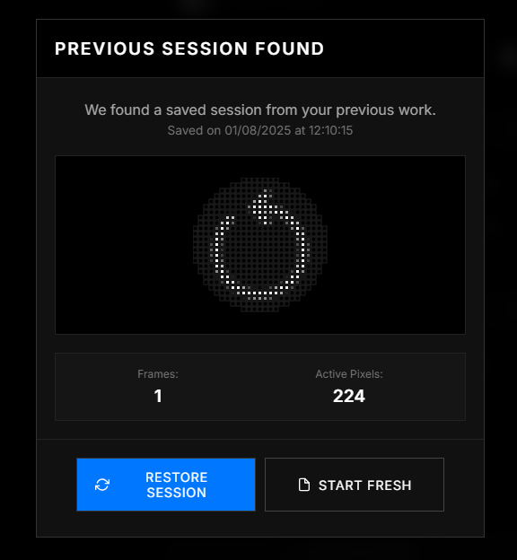

# Glyph Matrix Editor 🎨

> A web-based pixel art editor specifically designed for creating Nothing Phone 3 Glyph Matrix animations

## 🆕 What's New

### Latest Updates

- 🎯 **Advanced Selection Mode** - Select and manipulate specific areas of your artwork
- 🛠️ **Selection Operations** - Move, copy/paste, fill/clear selected regions
- ⌨️ **Keyboard Shortcuts** - Speed up your workflow with intuitive hotkeys
- 🗂️ **New Navigation Header** - New navigation tabs for improved UI organization

### Other Recent Updates

- 💾 **Auto-Save & Restore** - Never lose your work with automatic session saving and restore prompts
- 🎨 **Eyedropper Tool** - Sample pixel opacity values from your existing artwork

- 🎞️ **Animation** - Build a timeline to animate your designs 
- 🎬 **GIF Import Support** - Transform animated GIFs directly into matrix animations
- 📤 **GIF Export** - Export your animations as GIF files for easy sharing

## ✨ Features

### 🎯 Core Functionality
- **25-Pixel Matrix Grid**: Matches the exact Nothing Phone 3 Glyph Matrix shape pattern
- **Multi-Frame Animation**: Create smooth animations with customizable frame duration (50-1000ms)
- **Real-time Preview**: See your animations play as you create them
- **Undo/Redo System**: Full history management for worry-free editing

### 🪄 Editing Tools
- **Advanced Selection Mode**: Select regions for precise editing
- **Selection Operations**: Move, copy, paste, fill, and clear selected areas
- **Keyboard Shortcuts**: Efficient workflow with hotkeys for all major operations
- **Fill, Clear & Invert**: Quick transformations for creative effects
- **Mirror, Flip & Rotate**: Transform your artwork with ease

### ⬇️ Import Options
- **Images**: Convert any image to pixel art with automatic brightness/contrast adjustment
- **Text-to-Pixel**: Convert text using custom pixel fonts (Ndot57, NType82, Ranyth)
- **Emoji-to-Pixel**: Transform emojis into pixel art
- **GIFs**: Transform animations directly into the matrix
- **Pixel Data**: Transform pixel data back into design

### ⬆️ Export Formats
- **PNG Download**: High-quality image export for sharing
- **Animation Export**: Export complete animations into GIF
- **Pixel Data**: Share matrix design in pixel data format

 

---

 

**[⭐ Star this project](https://github.com/pauwma/GlyphMatrixPaint)** if you find it useful!

Made with ❤️ for the Nothing community

